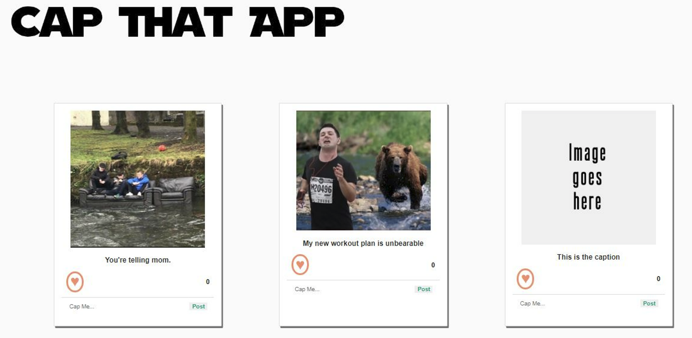

# Cap-That-App

The basic story of your application
- (BOTH) As a user, I want to see photos from tenor API
- (BOTH) As a user, I want to see a photo with captions
- (BOTH) As a user, I want to vote for my favorite captions by clicking
- (BOTH) As a user, I want to submit my own caption that will appear with all other captions and that can be voted on
- (BOTH) As a user, I want to submit my own photos that will appear with all other photos
- (BROOKS) As a user, I want to see my submitted photo/gif appear as the first caption on the page
- (MADI) As a user, I want to see the caption with the highest vote at the top of the list of captions

The core features of your MVP
- See funny photos/gifs, create captions for it, and vote on the best captions

The API data you'll be using and how you'll use it
- https://g.tenor.com/v1/search?q=funny-fail&key=RPJ2769J8BEG&limit=8

Challenges you expect to face
- Pulling a sample size of photos from imgur for our MVP
- Making sure the caption with the most votes appear at the top
- Being able to click to the next photo that will maintain all event features

How you are meeting the requirements of the project
Your app must be a HTML/CSS/JS frontend that accesses data from a public API. All interactions between the client and the API should be handled asynchronously and use JSON as the communication format.
    - Using API data from imgur
Your entire app must run on a single page. There should be NO redirects. In other words, your project will contain a single HTML file.
    - Our MVP will be on a single page
Your app needs to incorporate at least 3 separate event listeners (DOMContentLoaded, click, change, submit, etc).
    - Click to like
Submit form to add caption
    - Submit form to add new photo
Some interactivity is required. This could be as simple as adding a "like" button or adding comments. These interactions do not need to persist after reloading the page.
    - Click to like
Follow good coding practices. Keep your code DRY (Do not repeat yourself) by utilizing functions to abstract repetitive code.
    - We will do this

